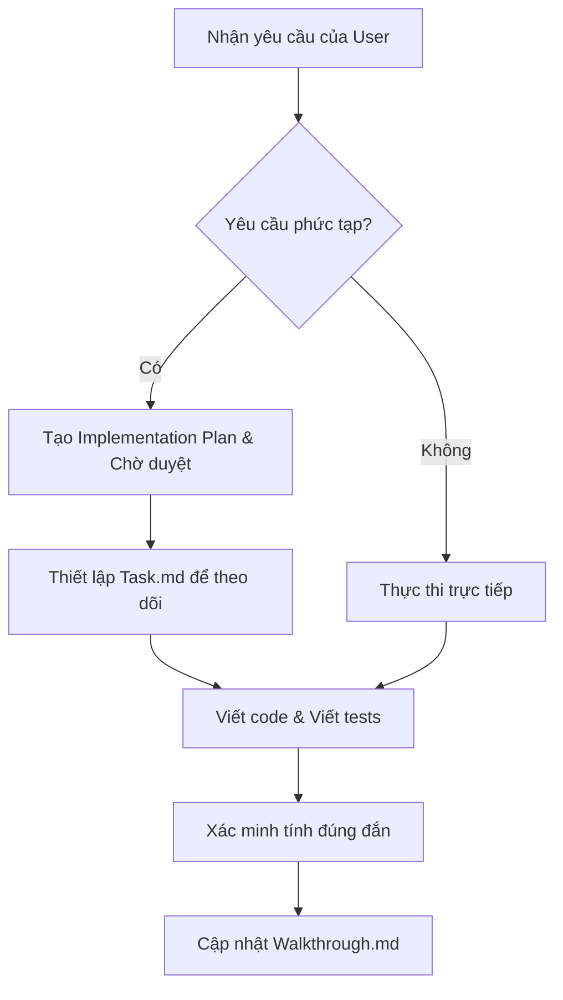

# Hướng Dẫn Hoạt Động Cho AI Agent (AI Agent Guidelines)

Tài liệu này quy định cách thức hoạt động, tiêu chuẩn lập trình, và quy trình phát triển mà **AI Agent** phải tuân thủ nghiêm ngặt khi xây dựng và mở rộng dự án **Mèo Nổ (Exploding Kittens Online)**.

---

## 1. Nguyên Tắc Cốt Lõi (Core Principles)

### 1.1. Server là Nguồn Sự Thật Duy Nhất (Single Source of Truth)
- Không bao giờ lưu trữ hoặc tự ý thay đổi trạng thái trò chơi (game state) ở phía Client.
- Client chỉ nhận dữ liệu hiển thị từ Server gửi về và phát ra các sự kiện hành động (event emissions).
- Server phải kiểm tra tính hợp lệ của mọi hành động của Client trước khi cập nhật State.

### 1.2. Bảo Mật Bài Trên Tay (Hand Secrecy)
- Bài trên tay của một người chơi phải được giữ bí mật tuyệt đối.
- Server **không bao giờ** gửi mảng `hand` chứa danh sách bài chi tiết của người chơi này cho người chơi khác.
- Giao diện công cộng chỉ được phép biết số lượng bài trên tay của người chơi khác (`handCount`).
- Sử dụng hàm `sanitizePublicGameState` để lọc sạch dữ liệu riêng tư trước khi broadcast cho toàn phòng chơi. Dữ liệu bài cụ thể chỉ gửi qua sự kiện `game:privateHand` tới đúng Socket của chủ sở hữu.

### 1.3. Cơ Chế Bất Đồng Bộ Thời Gian Thực (Timeouts & Windows)
- **Nope Window (3 giây)**: Sau khi một người chơi đánh một lá bài có thể bị Nope (ngoại trừ Defuse và Nope), Server phải mở một cửa sổ chờ dài đúng 3 giây thông qua `setTimeout`.
  - Nếu có sự kiện `game:nope` hợp lệ gửi lên trong khoảng thời gian này, Server sẽ đảo ngược hoặc hủy hiệu ứng lá bài đó và thông báo cập nhật trạng thái mới.
  - Nếu hết 3 giây mà không có Nope, hiệu ứng bài sẽ được thực thi hoàn chỉnh trên Server.
- **Favor Response Window (15 giây)**: Khi một người chơi yêu cầu Favor từ người khác, Server sẽ chờ 15 giây để người bị yêu cầu chọn bài phản hồi (`game:favor:respond`).
  - Nếu quá 15 giây mà không có phản hồi, Server sẽ tự động bốc ngẫu nhiên một lá bài từ tay người đó để chuyển cho người yêu cầu.

### 1.4. Tính Toàn Vẹn Của Hệ Thống Tiền Tệ (Coin Economy)
- Mỗi khi tăng hoặc giảm Coin/Gem của người dùng (Thắng game, Thua game, Đăng nhập hàng ngày, Mua skin, Biểu cảm), bắt buộc phải:
  1. Cập nhật trực tiếp vào trường `coins` hoặc `gems` trong model `User`.
  2. Tạo bản ghi lịch sử tương ứng trong model `Transaction` để đối soát hệ thống.

---

## 2. Tiêu Chuẩn Lập Trình (Coding Standards)

### 2.1. Backend (Node.js + Express + Socket.io)
- **Cấu trúc Modules**:
  - Tách biệt logic xử lý bài (`server/game/deck.js`), logic hiệu ứng bài (`server/game/gameLogic.js`) và logic phòng chờ (`server/game/roomManager.js`).
  - Không viết code logic game trực tiếp trong file socket handler `gameSocket.js`.
- **JWT Auth**:
  - Mọi API REST liên quan đến thông tin cá nhân, bạn bè, mua sắm đều phải qua `authMiddleware.js` để giải mã token và gán thông tin vào `req.user`.
  - Kết nối Socket.io cũng cần được xác thực JWT tại middleware kết nối (`io.use`) để gán thông tin `socket.user`.

### 2.2. Frontend (React 18 + Vite + Tailwind CSS)
- **Quản lý Socket Lifecycle**:
  - Đảm bảo việc đăng ký lắng nghe sự kiện (`socket.on`) chỉ được gọi một lần trong React Lifecycle (thường là trong `useEffect`).
  - Phải dọn dẹp (cleanup) sự kiện bằng `socket.off` hoặc `socket.removeAllListeners` khi Component bị unmount để tránh rò rỉ bộ nhớ (memory leaks) và trùng lặp sự kiện.
- **Styling**:
  - Sử dụng Tailwind CSS kết hợp cấu hình thiết kế trực quan hiện đại (Glassmorphism, Gradient màu tối, Micro-animations bằng Framer Motion).
  - Không dùng CSS thuần rải rác. Tất cả định dạng dùng các Utility Classes của Tailwind hoặc cấu hình trong `tailwind.config.js`.

---

## 3. Quy Trình Làm Việc Của AI Agent (AI Agent Workflow)

Mỗi khi AI Agent nhận một yêu cầu phát triển tính năng mới từ User, Agent cần tuân thủ các bước:

### Bước 1: Nghiên Cứu & Lập Kế Hoạch
- Tìm hiểu cấu trúc và mã nguồn hiện tại bằng công cụ tìm kiếm (`grep_search`, `view_file`).
- Nếu yêu cầu phức tạp (Ví dụ: Thêm cơ chế giải đấu, làm lại giao diện GameBoard lớn), hãy viết file `implementation_plan.md` trong thư mục Artifacts của phiên làm việc và yêu cầu User phản hồi (`requestFeedback: true`).

### Bước 2: Thiết Lập Danh Sách Công Việc (`task.md`)
- Tạo tệp `task.md` để liệt kê các đầu việc cụ thể.
- Đánh dấu trạng thái tiến độ: `[ ]` chưa làm, `[/]` đang làm, `[x]` đã hoàn thành.

### Bước 3: Phát Triển & Viết Tài Liệu
- Viết code sạch sẽ, chú thích rõ ràng bằng Tiếng Việt hoặc Tiếng Anh phù hợp với ngữ cảnh code.
- Luôn giữ lại các chú thích placeholder quan trọng để người mới bắt đầu có thể hiểu được.

### Bước 4: Kiểm Tra & Xác Minh (Verification)
- Khởi chạy dev server bằng `run_command` (`npm run dev`) trên cả client và server để kiểm tra lỗi biên dịch.
- Viết các test script đơn giản hoặc thực hiện các bước kiểm nghiệm thủ công.

### Bước 5: Cập Nhật Lịch Sử Thay Đổi (`walkthrough.md`)
- Tạo tệp `walkthrough.md` liệt kê các thay đổi đã thực hiện và kết quả kiểm tra để User dễ dàng theo dõi.
- Tránh mô tả lại chi tiết dài dòng trong đoạn chat chính. Chỉ hướng User xem tệp walkthrough hoặc kế hoạch thực hiện.
